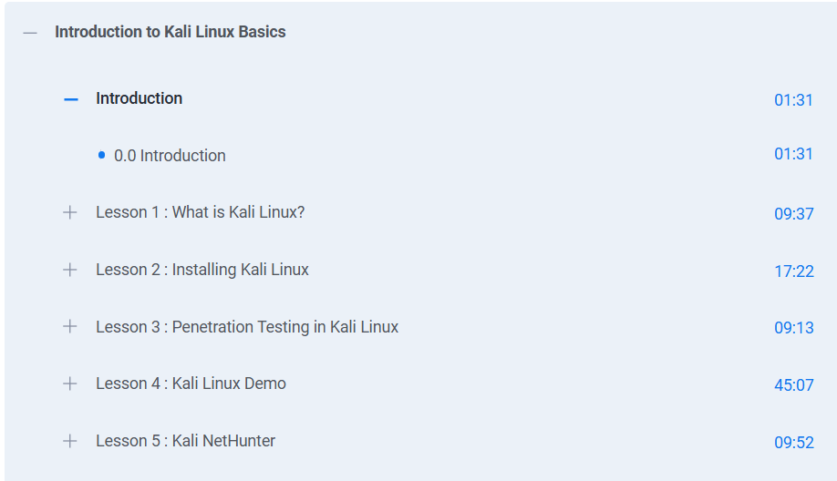

# 🐉 Introduction to Kali Linux Basics – Simplilearn

This repository contains **notes, labs, cheatsheets, tutorials, extras, and a certificate of completion** for the  
*Introduction to Kali Linux Basics* course by **Simplilearn**.  
The program introduces learners to **Kali Linux installation, basic commands, security tools, and hands-on labs** for practical cybersecurity skills.

---

## 📚 Notes
- 📄 [01-introduction.md](./notes/01-introduction.md) – Course introduction  
- 📄 [02-kali-installation.md](./notes/02-kali-installation.md) – Installing Kali Linux  
- 📄 [03-basic-commands.md](./notes/03-basic-commands.md) – Command line basics  
- 📄 [04-file-system.md](./notes/04-file-system.md) – File system navigation  
- 📄 [05-users-permissions.md](./notes/05-users-permissions.md) – Users, groups, and permissions  

---

## 📋 Cheatsheets
- 📘 [basic-commands.md](./cheatsheets/basic-commands.md) – Command line quick reference  
- 📘 [networking-basics.md](./cheatsheets/networking-basics.md) – Networking commands & tips  
- 📘 [security-tools.md](./cheatsheets/security-tools.md) – Key security tools cheat sheet  

---

## 🛠 Tutorials
- 📄 [basic-network-scanning.md](./tutorials/basic-network-scanning.md) – Simple Nmap scan tutorial  
- 📄 [installing-kali-tools.md](./tutorials/installing-kali-tools.md) – Installing extra security tools  
- 📄 [setting-up-lab-environment.md](./tutorials/setting-up-lab-environment.md) – Preparing virtual lab environment  

---

## 🔬 Extras
- 📑 [case-studies.md](./extras/case-studies.md) – Real-world Kali Linux applications  
- 📑 [resources.md](./extras/resources.md) – Additional learning materials  
- 📆 [timeline.md](./extras/timeline.md) – Course timeline & study plan  

---

## 📖 Docs
- 📘 [index.md](./docs/index.md) – Program overview  
- 📘 [glossary.md](./docs/glossary.md) – Glossary of terms  
- 📘 [references.md](./docs/references.md) – External references  
- 📘 [roadmap.md](./docs/roadmap.md) – Learning roadmap  
- 📘 [syllabus.md](./docs/syllabus.md) – Course syllabus  

---

## 📸 Screenshots

| Step | Screenshot |
|------|------------|
| 🏫 Introduction |  |

---

## 📜 Certificate
🎓 [Certificate of Completion – Introduction to Kali Linux Basics](./cert/8779947_91613071755093241305.pdf)  

---

## 📝 Personal Review
This course provides a **solid foundation in Kali Linux basics**,  
from **installation and command line usage** to **essential security tools and hands-on labs**.  
The combination of **tutorials, notes, and practical exercises** helps learners develop both **theoretical knowledge** and **practical cybersecurity skills**.

---

## ✍️ Author
**Thành Danh** – Red Team Learner & Security Researcher  

- GitHub: [@ngvuthdanhh](https://github.com/ngvuthdanhh)  
- Email: ngvu.thdanh@gmail.com  

---

## 📄 License
This project is licensed under the terms of the **MIT License**. See [LICENSE](./LICENSE) for full details.  
© 2025 ngvuthdanhh. All rights reserved.
